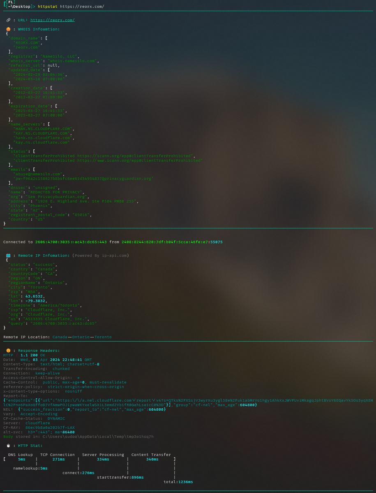
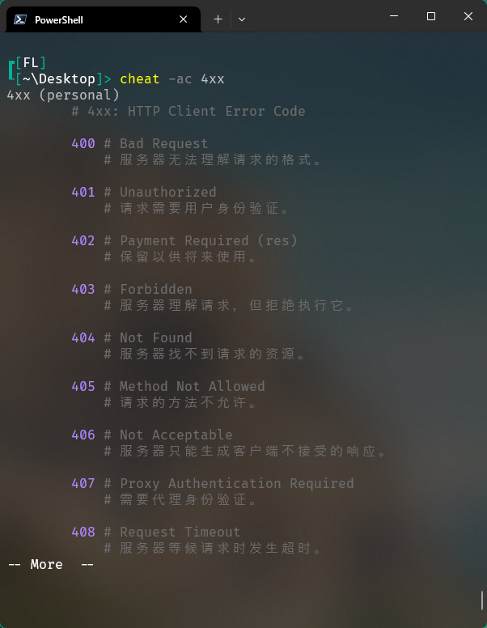

# httpstat_pro



httpstat_pro visualizes `IP Infomation`, `WHOIS Infomation` and `curl(1)` statistics in a way of beauty and clarity.

❗It is **not compatible** with **Python 2**.

❗It is **not a single file** Python script, requires `rich` and `python-whois`.

❗Not sure if Linux is supported.


## Installation

- Download the `httpstat.py`  script and `requirements.txt`

- `pip install -r requirements.txt`


## Usage

### Simply:

```powershell
python httpstat.py httpbin.org/get
```

### Set Powershell Alias:

```powershell
notepad.exe $PROFILE
```

then add the httpstat function to the file that opens up.

❗Don't forget to change the path to where you saved the `httpstat.py`.

```powershell
#httpstat
function httpstat {
    python 'C:\Users\sudoo\Documents\httpstat\httpstat.py' $args
}

```

### Cheatsheet Usage:
Install [cheat](https://github.com/cheat/cheat)

Move 📁`personal` to `%AppData% \Roaming\cheat\cheatsheets\`

then use the command below to get the cheatsheet.

```powershell
cheat -ac httpstat
cheat 1xx
cheat 2xx
cheat 3xx
cheat 4xx
cheat 5xx
```



### cURL Options

Because `httpstat` is a wrapper of cURL, you can pass any cURL supported option after the url (except for `-w`, `-D`, `-o`, `-s`, `-S` which are already used by `httpstat`):

```bash
httpstat httpbin.org/post -X POST --data-urlencode "a=b" -v
```

### Environment Variables

`httpstat` has a bunch of environment variables to control its behavior.
Here are some usage demos, you can also run `httpstat --help` to see full explanation.

<details>
<summary><strong><code>HTTPSTAT_SHOW_BODY</code></strong></summary>

Set to `true` to show response body in the output, note that body length
is limited to 1023 bytes, will be truncated if exceeds. Default is `false`.
</details>


<details>
<summary><strong><code>HTTPSTAT_SHOW_IP</code></strong></summary>

By default httpstat shows remote and local IP/port address.
Set to `false` to disable this feature. Default is `true`.
</details>

<details>
<summary><strong><code>HTTPSTAT_SHOW_WHOIS</code></strong></summary>

By default httpstat shows whois info of the remote IP.
Set to `false` to disable this feature. Default is `true`.
</details>


<details>
<summary><strong><code>HTTPSTAT_SHOW_SPEED</code></strong></summary>

Set to `true` to show download and upload speed.  Default is `false`.

```bash
HTTPSTAT_SHOW_SPEED=true httpstat http://cachefly.cachefly.net/10mb.test

...
speed_download: 3193.3 KiB/s, speed_upload: 0.0 KiB/s
```
</details>


<details>
<summary><strong><code>HTTPSTAT_SAVE_BODY</code></strong></summary>

By default httpstat stores body in a tmp file,
set to `false` to disable this feature. Default is `true`
</details>


<details>
<summary><strong><code>HTTPSTAT_CURL_BIN</code></strong></summary>

Indicate the cURL bin path to use. Default is `curl` from current shell $PATH.

This exampe uses brew installed cURL to make HTTP2 request:

```bash
HTTPSTAT_CURL_BIN=/usr/local/Cellar/curl/7.50.3/bin/curl httpstat https://http2.akamai.com/ --http2

HTTP/2 200
...
```

> cURL must be compiled with nghttp2 to enable http2 feature
> ([#12](https://github.com/reorx/httpstat/issues/12)).
</details>


<details>
<summary><strong><code>HTTPSTAT_DEBUG</code></strong></summary>

Set to `true` to see debugging logs. Default is `false`
</details>


For convenience, you can export these environments in your `.zshrc` or `.bashrc`,
example:

```bash
export HTTPSTAT_SHOW_IP=false
export HTTPSTAT_SHOW_SPEED=true
export HTTPSTAT_SAVE_BODY=false
```

---

## Related Projects

Here are some implementations in various languages:


- Go: [davecheney/httpstat](https://github.com/davecheney/httpstat)

  This is the Go alternative of httpstat, it's written in pure Go and relies no external programs. Choose it if you like solid binary executions (actually I do).

- Go (library): [tcnksm/go-httpstat](https://github.com/tcnksm/go-httpstat)

  Other than being a cli tool, this project is used as library to help debugging latency of HTTP requests in Go code, very thoughtful and useful, see more in this [article](https://medium.com/@deeeet/trancing-http-request-latency-in-golang-65b2463f548c#.mm1u8kfnu)

- Bash: [b4b4r07/httpstat](https://github.com/b4b4r07/httpstat)

  This is what exactly I want to do at the very beginning, but gave up due to not confident in my bash skill, good job!

- Node: [yosuke-furukawa/httpstat](https://github.com/yosuke-furukawa/httpstat)

  [b4b4r07](https://twitter.com/b4b4r07) mentioned this in his [article](http://www.tellme.tokyo/entry/2016/09/25/213810), could be used as a HTTP client also.

- PHP: [talhasch/php-httpstat](https://github.com/talhasch/php-httpstat)

  The PHP implementation by @talhasch

Some code blocks in `httpstat` are copied from other projects of mine, have a look:

- [reorx/python-terminal-color](https://github.com/reorx/python-terminal-color) Drop-in single file library for printing terminal color.

- [reorx/getenv](https://github.com/reorx/getenv) Environment variable definition with type.
